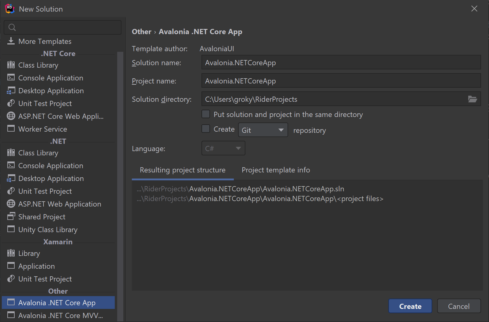

## JetBrains Rider

The [JetBrains Rider](https://www.jetbrains.com/rider/) IDE has built-in support for Avalonia XAML [starting in 2020.3](https://www.jetbrains.com/rider/whatsnew/2020-3/#version-2020-3-avalonia-support) including first-class support for Avalonia-specific XAML features and custom code inspections.

Rider uses the .NET CLI templates installed on your machine, to install the templates run:

```
dotnet new -i Avalonia.Templates
```

Once the templates are installed, Rider should allow you to create Avalonia projects from its "New Solution" dialog:



See the the [.NET CLI](#net-cli) section for more information about the available templates.

## Visual Studio

The easiest way to get started with Avalonia from Visual Studio is to [install the extension](https://marketplace.visualstudio.com/items?itemName=AvaloniaTeam.AvaloniaforVisualStudio) from the Visual Studio Marketplace.

Installing the extension will add a couple of project templates to Visual Studio, under the `Avalonia` heading. The installed templates are:

- **Avalonia Application**: This will create a barebones Avalonia application
- **Avalonia MVVM Application**: This will create an application that uses the Model-View-ViewModel pattern with [ReactiveUI](https://reactiveui.net/)


By default these application templates will dual-target .NET Framework 4.6.1 and .NET Core 2.0.

Once you have an Avalonia application, two item templates will become available:

- **Window**: Creates a new top-level [`Window`](../controls/window)
- **UserControl**: Create a new [`UserControl`](../controls/usercontrol)

## .NET CLI

First install the Avalonia templates for .NET Core by running:

```
dotnet new -i Avalonia.Templates
```

This will add a couple of project templates to `dotnet`:

- **`avalonia.app`**: This will create a barebones Avalonia application
- **`avalonia.mvvm`**: This will create an application that uses the Model-View-ViewModel pattern with [ReactiveUI](https://reactiveui.net/)

To create a project using the templates use `dotnet new`:

```powershell
dotnet new avalonia.app -o MyApp
```

Where `avalonia.app` is the name of the template to use and `MyApp` is the name of the project to create.

Once you have an Avalonia application, there are two item templates available:

- **`avalonia.window`**: Creates a new top-level [`Window`](../controls/window)
- **`avalonia.usercontrol`**: Create a new [`UserControl`](../controls/usercontrol)
